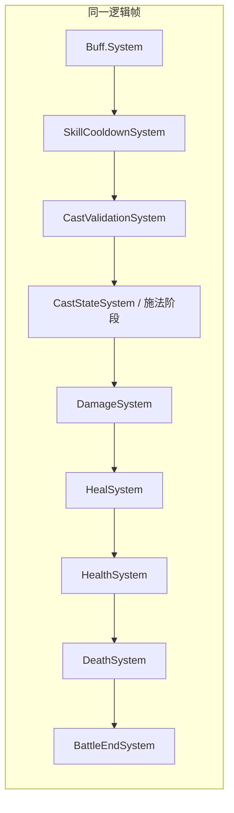
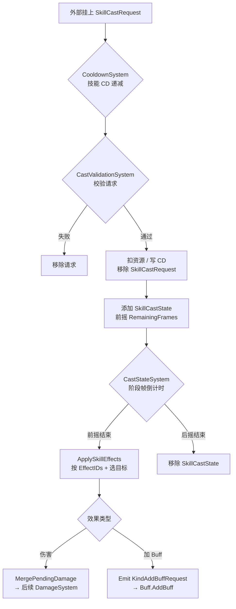
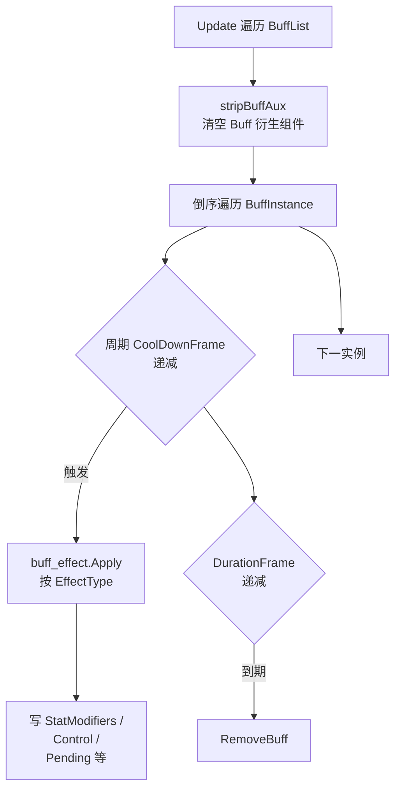
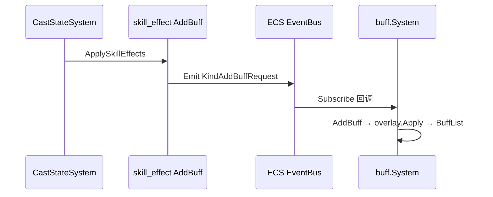

# Buff 与技能系统说明

本文描述 `internal/battle/system/buff` 与 `internal/battle/system/skill` 的职责、数据流及与战斗管线的关系；流程图使用 Mermaid，可在支持 Mermaid 的编辑器或 Git 平台中预览。

---

## 一、Buff 系统（`internal/battle/system/buff`）

### 职责

维护实体上的 **Buff 列表**，按帧驱动 **周期效果**与**持续时间**，并通过 **叠层策略**处理重复施加。

### 核心数据

- `component.BuffList`：若干 `BuffInstance`（`BuffId`、层数 `Stacks`、`DurationFrame`、`CoolDownFrame`、施法者 `Caster` 等）。
- 配置：`config.Tab.BuffConfigConfigByID`（持续时间、周期冷却 `CoolingFrame`、叠层行为 `StackBehavior`、效果类型 `EffectType` 等）。

### 入口

- **事件**：`buff.System.Initialize` 里订阅 `KindAddBuffRequest` / `KindRemoveBuffRequest`，内部转调 `AddBuff` / `RemoveBuff`。
- **直接调用**：`AddBuff(caster, target, buffId)`（技能通过事件加 Buff 最终会走到同一逻辑）。

### 叠层（`overlay`）

按 `BuffStackBehavior` 分发：**替换 / 刷新时长 / 叠层 / 忽略** 等（`overlay.Apply` → `stackPolicyDict`）。

### 每帧 `Update`（对带 `BuffList` 的实体）

1. **`stripBuffAux`**：先摘掉 Buff 衍生的聚合组件（`StatModifiers`、`ControlState`、`PendingDamageBuff`、`PendingHealBuff`），后面由本轮 Buff 重新写入。
2. **倒序**遍历每个 `BuffInstance`（避免移除时切片错位）。
3. **配置缺失**则移除该 Buff。
4. **周期**：`CoolDownFrame--`，≤0 时调用 **`buff_effect.Apply`**（按 `EffectType` 注册表：`StatChange`、`Control`、`Damage`、`Heal`），并按配置的 `CoolingFrame` 重置周期计时。
5. **持续时间**：`DurationFrame` 递减，≤0 则 **`RemoveBuff`**。

### 效果实现（`buff_effect`）

- **属性**：累加到 `StatModifiers`（随层数缩放等）。
- **控制**：写入 `ControlState`。
- **伤害/治疗**：写入 `PendingDamageBuff` / `PendingHealBuff`（由后续战斗管线中的对应逻辑消费）。

---

## 二、技能系统（`internal/battle/system/skill`）

### 职责

管理 **技能槽与冷却**、校验 **施法请求**、驱动 **前摇 → 生效 → 后摇**，并按配置 **选目标 + 执行技能效果**。

### 核心数据

- `SkillSet` / `RuntimeSkill`：`ConfigID`、`CurrentCooldown`（帧）。
- `SkillCastRequest`：**施法唯一入口**（玩法层用 `skill.RequestSkillCast` / `skill.SetSkillCastRequest` 写入；含 `SkillID`、`TargetEntity` 等）。已移除 `CastIntent`。
- `SkillCastState`：`Phase`、`RemainingFrames`、`SkillId`、目标与位置等。

### 辅助 API

- `skill.System`：提供 **`AddSkill` / `RemoveSkill`**，往实体上挂 `SkillSet`，不负责每帧施法逻辑。

### 每帧管线中与技能相关的 System（顺序见第三节）

1. **`SkillCooldownSystem`**：对所有 `RuntimeSkill` 的 `CurrentCooldown` 每帧减一（钳制到 ≥0）。
2. **`CastValidationSystem`**：查询 `SkillSet + Attributes + SkillCastRequest`。校验：未在施法中、请求有效、配置存在、可行动（含控制）、非沉默、CD 已好；资源足够则扣费。通过后移除 `SkillCastRequest`，写入技能 **CD**，挂上 **`SkillCastState`**（从前摇、`PreCastFrames` 开始）。
3. **`CastStateSystem`**：驱动 `SkillCastState` 的帧倒计时；阶段结束时调用 **`skill_effect.ApplySkillEffects`**，再进入后摇帧数，结束后移除 `SkillCastState`。

### 技能效果（`skill_effect`）

- `CastStateSystem.ApplyEffects`：按 **EffectIDs** 顺序，用 **`target_selector.SelectForCast`**（点选目标优先）解析目标列表，再按 `EffectType` 分发。
- 已实现示例：**伤害** → `MergePendingDamage`（交给 `DamageSystem`）；**加 Buff** → `EmitEvent(KindAddBuffRequest)`，由 **Buff 系统**订阅并 `AddBuff`。

---

## 三、整体战斗帧顺序（`AddCoreCombatSystems`）

注册顺序为：

**刷怪 → Buff → 技能 CD → 施法校验 → 施法阶段推进 → 伤害 → 治疗 → 扣血 → 死亡 → 战斗结束**

（开房首帧：`BattleInitSystem` → `room_bootstrap.Bootstrap` 挂载上述 System 并入队刷怪。）

同一帧内：**Buff 先更新**（含周期效果、属性汇总），再 **减技能 CD**，再 **处理施法请求**，再 **推进施法状态并在生效阶段打出伤害/加 Buff**，之后才进入 **Damage / Heal / Health** 等。

---

## 四、流程图

### 1）单帧战斗管线（模块级）

### 2）技能：从请求到效果

### 3）Buff：单实体单帧

### 4）技能加 Buff 与 Buff 系统衔接

---

## 五、相关源码索引

| 主题 | 路径 |
|------|------|
| 战斗 System 注册顺序 | `internal/battle/system/register.go` |
| Buff 主循环 / AddBuff | `internal/battle/system/buff/system.go` |
| Buff 周期效果注册 | `internal/battle/system/buff/buff_effect/registry.go` |
| Buff 叠层策略 | `internal/battle/system/buff/overlay/overlay.go` |
| 技能 CD | `internal/battle/system/skill/system_skill_cooldown.go` |
| 施法校验 | `internal/battle/system/skill/system_skill_validation.go` |
| 施法阶段 | `internal/battle/system/skill/system_skill_cast_state.go` |
| 技能效果注册 | `internal/battle/system/skill/skill_effect/registry.go` |
| 技能组件定义 | `internal/battle/component/comp_skill.go` |
